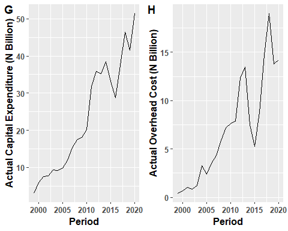
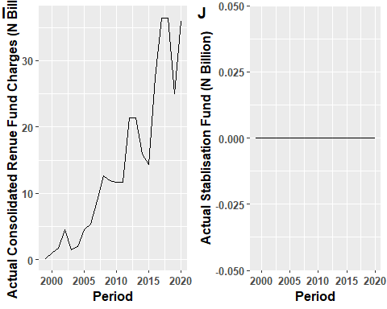

## Load the Required Packages


```r
install.packages("pastecs")  
install.packages("fBasics")
install.packages("timeDate")
install.packages("timeSeries")
install.packages("stats")
install.packages("vars")
install.packages("ggfortify")
tinytex::install_tinytex()
install.packages("tibble")
```
## Load library


```r
library(pastecs)
library(timeDate)
library(timeSeries)
library(fBasics)
library(dplyr)
```

```
## 
## Attaching package: 'dplyr'
```

```
## The following objects are masked from 'package:timeSeries':
## 
##     filter, lag
```

```
## The following objects are masked from 'package:pastecs':
## 
##     first, last
```

```
## The following objects are masked from 'package:stats':
## 
##     filter, lag
```

```
## The following objects are masked from 'package:base':
## 
##     intersect, setdiff, setequal, union
```

```r
library(ggplot2)
library(tidyr)
```

```
## 
## Attaching package: 'tidyr'
```

```
## The following object is masked from 'package:pastecs':
## 
##     extract
```

```r
library(vars)
```

```
## Loading required package: MASS
```

```
## 
## Attaching package: 'MASS'
```

```
## The following object is masked from 'package:dplyr':
## 
##     select
```

```
## Loading required package: strucchange
```

```
## Loading required package: zoo
```

```
## 
## Attaching package: 'zoo'
```

```
## The following object is masked from 'package:timeSeries':
## 
##     time<-
```

```
## The following objects are masked from 'package:base':
## 
##     as.Date, as.Date.numeric
```

```
## Loading required package: sandwich
```

```
## Loading required package: urca
```

```
## Loading required package: lmtest
```

```r
library(ggfortify)
library(GGally)
```

```
## Registered S3 method overwritten by 'GGally':
##   method from   
##   +.gg   ggplot2
```

```r
library(ggpubr)
library(tinytex)
library(tibble)
```
## Read the data


```r
bud <- read.csv("~/PhD_Thesis/Data/budget_information.csv", header = TRUE)
bud <- as_tibble(bud)
```

## Inspect the data


```r
names(bud) # To know the variable names
```

```
##  [1] "period" "PCe"    "PCa"    "OCe"    "OCa"    "CRFCe"  "CRFCa"  "SFe"   
##  [9] "SFa"    "CAPEXe" "CAPEXa" "IGRe"   "IGRa"   "SAe"    "SAa"    "VATe"  
## [17] "VATa"   "ORe"    "ORa"    "CRe"    "CRa"    "TRRe"   "TRRa"   "TRe"   
## [25] "TRa"    "TREe"   "TREa"   "TEe"    "TEa"
```

```r
str(bud)  # To know the class of the variables
```

```
## tibble [22 x 29] (S3: tbl_df/tbl/data.frame)
##  $ period: int [1:22] 1999 2000 2001 2002 2003 2004 2005 2006 2007 2008 ...
##  $ PCe   : num [1:22] 2.00e+09 4.05e+09 9.11e+09 1.01e+10 1.14e+10 ...
##  $ PCa   : num [1:22] 3.07e+09 5.90e+09 7.49e+09 7.65e+09 9.39e+09 ...
##  $ OCe   : num [1:22] 4.35e+08 7.15e+08 1.11e+09 1.71e+09 2.10e+09 ...
##  $ OCa   : num [1:22] 4.36e+08 6.39e+08 1.02e+09 8.59e+08 1.24e+09 ...
##  $ CRFCe : num [1:22] 1.15e+09 7.47e+08 1.84e+09 1.77e+09 2.50e+09 ...
##  $ CRFCa : num [1:22] 2.03e+08 1.01e+09 1.75e+09 4.55e+09 1.43e+09 ...
##  $ SFe   : num [1:22] 1.2e+07 0.0 0.0 0.0 0.0 0.0 0.0 0.0 0.0 0.0 ...
##  $ SFa   : num [1:22] 0 0 0 0 0 0 0 0 0 0 ...
##  $ CAPEXe: num [1:22] 5.33e+09 4.55e+09 8.27e+09 1.30e+10 1.26e+10 ...
##  $ CAPEXa: num [1:22] 3.25e+09 3.18e+09 4.15e+09 5.17e+09 3.04e+09 ...
##  $ IGRe  : num [1:22] 1.96e+09 1.79e+09 4.41e+09 5.55e+09 3.50e+09 ...
##  $ IGRa  : num [1:22] 1.06e+09 1.19e+09 1.44e+09 1.78e+09 2.41e+09 ...
##  $ SAe   : num [1:22] 5.29e+08 7.00e+08 1.00e+09 1.50e+09 2.00e+09 ...
##  $ SAa   : num [1:22] 7.58e+08 8.82e+08 1.37e+09 1.69e+09 1.98e+09 ...
##  $ VATe  : num [1:22] 2.06e+09 5.90e+09 1.19e+10 1.55e+10 1.60e+10 ...
##  $ VATa  : num [1:22] 3.17e+09 9.18e+09 8.48e+09 9.92e+09 1.29e+10 ...
##  $ ORe   : num [1:22] 0 0 0 0 0 ...
##  $ ORa   : num [1:22] 0 0 0 0 0 ...
##  $ CRe   : num [1:22] 4.38e+09 1.67e+09 3.00e+09 4.00e+09 7.08e+09 ...
##  $ CRa   : num [1:22] 1.81e+09 3.69e+07 3.57e+07 3.21e+09 9.83e+06 ...
##  $ TRRe  : num [1:22] 4.54e+09 8.39e+09 1.73e+10 2.26e+10 2.15e+10 ...
##  $ TRRa  : num [1:22] 4.99e+09 1.13e+10 1.13e+10 1.34e+10 1.73e+10 ...
##  $ TRe   : num [1:22] 8.92e+09 1.01e+10 2.03e+10 2.66e+10 2.86e+10 ...
##  $ TRa   : num [1:22] 6.80e+09 1.13e+10 1.13e+10 1.66e+10 1.73e+10 ...
##  $ TREe  : num [1:22] 3.60e+09 5.51e+09 1.21e+10 1.36e+10 1.60e+10 ...
##  $ TREa  : num [1:22] 3.71e+09 7.55e+09 1.03e+10 1.31e+10 1.21e+10 ...
##  $ TEe   : num [1:22] 8.92e+09 1.01e+10 2.03e+10 2.66e+10 2.86e+10 ...
##  $ TEa   : num [1:22] 6.96e+09 1.07e+10 1.44e+10 1.82e+10 1.51e+10 ...
```

## Computation of the annual budget performance

Annual Budget performance is Given as

$$bud\_perf=\frac{TEa}{TEe}*100\%$$

Where:
`bud_perf = Annual Budget Performance`
`TEa = Actual Total Expenditure`
`TEe = Estimated Total Expenditure`


```r
bud <- bud %>% 
  mutate(bud_perf=(TEa/TEe)*100)

names(bud)
```

```
##  [1] "period"   "PCe"      "PCa"      "OCe"      "OCa"      "CRFCe"   
##  [7] "CRFCa"    "SFe"      "SFa"      "CAPEXe"   "CAPEXa"   "IGRe"    
## [13] "IGRa"     "SAe"      "SAa"      "VATe"     "VATa"     "ORe"     
## [19] "ORa"      "CRe"      "CRa"      "TRRe"     "TRRa"     "TRe"     
## [25] "TRa"      "TREe"     "TREa"     "TEe"      "TEa"      "bud_perf"
```


## Transform the dataset into timeseries


```r
bud <- bud %>% 
  dplyr::select(-period) %>% 
  ts(start = 1999, end = 2020, frequency = 1)

bud[,c(1:28)] <- round((bud[,c(1:28)])/1e9,4) # Round values to Billion Naira
```


## Summary Statistics

```r
pastecs::stat.desc(bud)
```

```
##                      PCe         PCa         OCe         OCa      CRFCe
## nbr.val       22.0000000  22.0000000  22.0000000  22.0000000  22.000000
## nbr.null       0.0000000   0.0000000   0.0000000   0.0000000   0.000000
## nbr.na         0.0000000   0.0000000   0.0000000   0.0000000   0.000000
## min            1.9960000   3.0680000   0.4353000   0.4357000   0.747100
## max           56.0738000  51.4841000  25.3997000  19.0263000  53.287500
## range         54.0778000  48.4161000  24.9644000  18.5906000  52.540400
## sum          608.0931000 515.2026000 239.1108000 155.5500000 414.170400
## median        24.2503000  19.1306500  11.8296000   6.5369500  16.375850
## mean          27.6405955  23.4183000  10.8686727   7.0704545  18.825927
## SE.mean        3.8327130   3.1668960   1.7772418   1.1648187   3.439842
## CI.mean.0.95   7.9705630   6.5859207   3.6959767   2.4223731   7.153543
## var          323.1731550 220.6430625  69.4889483  29.8496575 260.315298
## std.dev       17.9770174  14.8540588   8.3360031   5.4634840  16.134290
## coef.var       0.6503846   0.6342928   0.7669753   0.7727203   0.857025
##                    CRFCa          SFe SFa       CAPEXe      CAPEXa        IGRe
## nbr.val       22.0000000 2.200000e+01  22   22.0000000  22.0000000   22.000000
## nbr.null       0.0000000 2.100000e+01  22    0.0000000   0.0000000    0.000000
## nbr.na         0.0000000 0.000000e+00   0    0.0000000   0.0000000    0.000000
## min            0.2034000 0.000000e+00   0    4.5461000   3.0433000    1.790900
## max           36.4422000 1.200000e-02   0  149.9420000  36.1319000  125.476800
## range         36.2388000 1.200000e-02   0  145.3959000  33.0886000  123.685900
## sum          311.9938000 1.200000e-02   0 1221.2736000 387.1054000  715.171500
## median        11.8145000 0.000000e+00   0   60.1184000  17.8852000   29.218600
## mean          14.1815364 5.454545e-04   0   55.5124364  17.5957000   32.507795
## SE.mean        2.5526103 5.454545e-04   0    8.4154864   2.5640696    7.089303
## CI.mean.0.95   5.3084438 1.134335e-03   0   17.5009620   5.3322747   14.743013
## var          143.3480304 6.545455e-06   0 1558.0490383 144.6379685 1105.680804
## std.dev       11.9728038 2.558409e-03   0   39.4721299  12.0265526   33.251779
## coef.var       0.8442529 4.690416e+00 NaN    0.7110502   0.6834938    1.022886
##                     IGRa         SAe         SAa        VATe        VATa
## nbr.val       22.0000000  22.0000000  22.0000000  22.0000000  22.0000000
## nbr.null       0.0000000   0.0000000   0.0000000   0.0000000   0.0000000
## nbr.na         0.0000000   0.0000000   0.0000000   0.0000000   0.0000000
## min            1.0600000   0.5293000   0.7580000   2.0577000   3.1727000
## max           30.5832000  55.0000000  48.5548000  50.4000000  59.0791000
## range         29.5232000  54.4707000  47.7968000  48.3423000  55.9064000
## sum          265.1137000 564.4045000 370.5486000 313.5282000 393.1257000
## median        11.7177500  29.8155500  10.3927500  11.0154000  12.5409500
## mean          12.0506227  25.6547500  16.8431182  14.2512818  17.8693500
## SE.mean        2.0288685   3.7385442   3.2355963   2.8384015   3.3177444
## CI.mean.0.95   4.2192630   7.7747282   6.7287909   5.9027791   6.8996272
## var           90.5587634 307.4876766 230.3198365 177.2435077 242.1634177
## std.dev        9.5162368  17.5353265  15.1762919  13.3132831  15.5616007
## coef.var       0.7896884   0.6835119   0.9010381   0.9341815   0.8708543
##                     ORe        ORa        CRe        CRa         TRRe
## nbr.val       22.000000  22.000000  22.000000  22.000000   22.0000000
## nbr.null       5.000000  13.000000   0.000000   0.000000    0.0000000
## nbr.na         0.000000   0.000000   0.000000   0.000000    0.0000000
## min            0.000000   0.000000   1.668700   0.009800    4.5448000
## max           40.212800  36.920800  78.500000  29.740100  226.6896000
## range         40.212800  36.920800  76.831300  29.730300  222.1448000
## sum          225.128100 157.397200 616.931300 133.536900 1790.5918000
## median         4.871600   0.000000  27.748300   3.496150   76.7401000
## mean          10.233095   7.154418  28.042332   6.069859   81.3905364
## SE.mean        2.476304   2.455726   5.003121   1.618309   12.4498854
## CI.mean.0.95   5.149755   5.106963  10.404561   3.365458   25.8909540
## var          134.905755 132.673036 550.686923  57.616325 3409.9921994
## std.dev       11.614894  11.518378  23.466719   7.590542   58.3951385
## coef.var       1.135032   1.609967   0.836832   1.250530    0.7174684
##                      TRRa          TRe          TRa         TREe        TREa
## nbr.val        22.0000000   22.0000000   22.0000000   22.0000000  22.0000000
## nbr.null        0.0000000    0.0000000    0.0000000    0.0000000   0.0000000
## nbr.na          0.0000000    0.0000000    0.0000000    0.0000000   0.0000000
## min             4.9907000    8.9238000    6.7979000    3.5975000   3.7071000
## max           131.8472000  271.7317000  142.4030000  127.5747000 101.8134000
## range         126.8565000  262.8079000  135.6051000  123.9772000  98.1063000
## sum          1186.1851000 2407.5231000 1319.7222000 1261.3863000 982.7465000
## median         56.0618500  113.6801500   58.2485500   52.6690000  38.3169500
## mean           53.9175045  109.4328682   59.9873727   57.3357409  44.6702955
## SE.mean         7.6569666   16.3127377    8.8037221    8.7532852   6.7090728
## CI.mean.0.95   15.9235338   33.9241952   18.3083423   18.2034531  13.9522806
## var          1289.8410370 5854.3190525 1705.1214891 1685.6400446 990.2564641
## std.dev        35.9143570   76.5135220   41.2931167   41.0565469  31.4683407
## coef.var        0.6660983    0.6991823    0.6883635    0.7160725   0.7044579
##                      TEe          TEa     bud_perf
## nbr.val        22.000000   22.0000000   22.0000000
## nbr.null        0.000000    0.0000000    0.0000000
## nbr.na          0.000000    0.0000000    0.0000000
## min             8.923800    6.9565000   32.0997054
## max           271.731700  137.9453000  106.6111519
## range         262.807900  130.9888000   74.5114465
## sum          2482.659700 1369.8520000 1365.2154511
## median        133.630100   61.9888500   61.9580887
## mean          112.848168   62.2660000   62.0552478
## SE.mean        16.563824    8.7358849    3.6591990
## CI.mean.0.95   34.446357   18.1672673    7.6097209
## var          6035.925516 1678.9450857  294.5742182
## std.dev        77.691219   40.9749324   17.1631646
## coef.var        0.688458    0.6580627    0.2765788
```


```r
fBasics::basicStats(bud)
```

```
##                    PCe        PCa        OCe        OCa      CRFCe      CRFCa
## nobs         22.000000  22.000000  22.000000  22.000000  22.000000  22.000000
## NAs           0.000000   0.000000   0.000000   0.000000   0.000000   0.000000
## Minimum       1.996000   3.068000   0.435300   0.435700   0.747100   0.203400
## Maximum      56.073800  51.484100  25.399700  19.026300  53.287500  36.442200
## 1. Quartile  11.340975   9.478000   2.643675   2.615200   5.435725   4.553525
## 3. Quartile  42.997600  35.667075  18.112750  11.488250  26.437500  21.402125
## Mean         27.640595  23.418300  10.868673   7.070455  18.825927  14.181536
## Median       24.250300  19.130650  11.829600   6.536950  16.375850  11.814500
## Sum         608.093100 515.202600 239.110800 155.550000 414.170400 311.993800
## SE Mean       3.832713   3.166896   1.777242   1.164819   3.439842   2.552610
## LCL Mean     19.670032  16.832379   7.172696   4.648081  11.672384   8.873093
## UCL Mean     35.611158  30.004221  14.564649   9.492828  25.979470  19.489980
## Variance    323.173155 220.643063  69.488948  29.849657 260.315298 143.348030
## Stdev        17.977017  14.854059   8.336003   5.463484  16.134290  11.972804
## Skewness      0.146818   0.264545   0.159977   0.502170   0.688087   0.614994
## Kurtosis     -1.638912  -1.428909  -1.569667  -0.981403  -0.699870  -0.944396
##                   SFe SFa      CAPEXe     CAPEXa        IGRe       IGRa
## nobs        22.000000  22   22.000000  22.000000   22.000000  22.000000
## NAs          0.000000   0    0.000000   0.000000    0.000000   0.000000
## Minimum      0.000000   0    4.546100   3.043300    1.790900   1.060000
## Maximum      0.012000   0  149.942000  36.131900  125.476800  30.583200
## 1. Quartile  0.000000   0   16.502900   5.284400    7.364700   3.050675
## 3. Quartile  0.000000   0   80.430550  29.465225   36.850025  16.271525
## Mean         0.000545   0   55.512436  17.595700   32.507795  12.050623
## Median       0.000000   0   60.118400  17.885200   29.218600  11.717750
## Sum          0.012000   0 1221.273600 387.105400  715.171500 265.113700
## SE Mean      0.000545   0    8.415486   2.564070    7.089303   2.028869
## LCL Mean    -0.000589   0   38.011474  12.263425   17.764783   7.831360
## UCL Mean     0.001680   0   73.013398  22.927975   47.250808  16.269886
## Variance     0.000007   0 1558.049038 144.637969 1105.680804  90.558763
## Stdev        0.002558   0   39.472130  12.026553   33.251779   9.516237
## Skewness     4.070195 NaN    0.372996   0.113322    1.390184   0.504076
## Kurtosis    15.266529 NaN   -0.689368  -1.684043    1.244671  -0.943279
##                    SAe        SAa       VATe       VATa        ORe        ORa
## nobs         22.000000  22.000000  22.000000  22.000000  22.000000  22.000000
## NAs           0.000000   0.000000   0.000000   0.000000   0.000000   0.000000
## Minimum       0.529300   0.758000   2.057700   3.172700   0.000000   0.000000
## Maximum      55.000000  48.554800  50.400000  59.079100  40.212800  36.920800
## 1. Quartile  11.375000   2.430975   4.625000   8.521650   2.187500   0.000000
## 3. Quartile  39.189000  29.360275  15.875000  19.507800  15.750000  11.044400
## Mean         25.654750  16.843118  14.251282  17.869350  10.233095   7.154418
## Median       29.815550  10.392750  11.015400  12.540950   4.871600   0.000000
## Sum         564.404500 370.548600 313.528200 393.125700 225.128100 157.397200
## SE Mean       3.738544   3.235596   2.838402   3.317744   2.476304   2.455726
## LCL Mean     17.880022  10.114327   8.348503  10.969723   5.083340   2.047455
## UCL Mean     33.429478  23.571909  20.154061  24.768977  15.382851  12.261381
## Variance    307.487677 230.319837 177.243508 242.163418 134.905755 132.673036
## Stdev        17.535327  15.176292  13.313283  15.561601  11.614894  11.518378
## Skewness     -0.141307   0.457585   1.705042   1.557811   1.099645   1.446845
## Kurtosis     -1.374043  -1.254281   2.117334   1.337699   0.073544   0.771780
##                    CRe        CRa        TRRe        TRRa         TRe
## nobs         22.000000  22.000000   22.000000   22.000000   22.000000
## NAs           0.000000   0.000000    0.000000    0.000000    0.000000
## Minimum       1.668700   0.009800    4.544800    4.990700    8.923800
## Maximum      78.500000  29.740100  226.689600  131.847200  271.731700
## 1. Quartile   5.683300   0.698850   31.406600   24.130925   35.868675
## 3. Quartile  45.638950   8.097975  110.705550   78.987075  169.306750
## Mean         28.042332   6.069859   81.390536   53.917505  109.432868
## Median       27.748300   3.496150   76.740100   56.061850  113.680150
## Sum         616.931300 133.536900 1790.591800 1186.185100 2407.523100
## SE Mean       5.003121   1.618309   12.449885    7.656967   16.312738
## LCL Mean     17.637771   2.704401   55.499582   37.993971   75.508673
## UCL Mean     38.446892   9.435317  107.281490   69.841038  143.357063
## Variance    550.686923  57.616325 3409.992199 1289.841037 5854.319053
## Stdev        23.466719   7.590542   58.395138   35.914357   76.513522
## Skewness      0.483315   1.595517    0.641721    0.350503    0.255797
## Kurtosis     -1.021866   2.004853   -0.262536   -1.053961   -1.170685
##                     TRa        TREe       TREa         TEe         TEa
## nobs          22.000000   22.000000  22.000000   22.000000   22.000000
## NAs            0.000000    0.000000   0.000000    0.000000    0.000000
## Minimum        6.797900    3.597500   3.707100    8.923800    6.956500
## Maximum      142.403000  127.574700 101.813400  271.731700  137.945300
## 1. Quartile   24.964775   19.365775  15.064350   35.868675   24.477975
## 3. Quartile   83.842200   95.483725  68.424550  173.205525   89.752150
## Mean          59.987373   57.335741  44.670295  112.848168   62.266000
## Median        58.248550   52.669000  38.316950  133.630100   61.988850
## Sum         1319.722200 1261.386300 982.746500 2482.659700 1369.852000
## SE Mean        8.803722    8.753285   6.709073   16.563824    8.735885
## LCL Mean      41.679030   39.132288  30.718015   78.401811   44.098733
## UCL Mean      78.295715   75.539194  58.622576  147.294525   80.433267
## Variance    1705.121489 1685.640045 990.256464 6035.925516 1678.945086
## Stdev         41.293117   41.056547  31.468341   77.691219   40.974932
## Skewness       0.390383    0.209503   0.369550    0.144679    0.325769
## Kurtosis      -1.138558   -1.535804  -1.250881   -1.293834   -1.165924
##                bud_perf
## nobs          22.000000
## NAs            0.000000
## Minimum       32.099705
## Maximum      106.611152
## 1. Quartile   50.576244
## 3. Quartile   70.568327
## Mean          62.055248
## Median        61.958089
## Sum         1365.215451
## SE Mean        3.659199
## LCL Mean      54.445527
## UCL Mean      69.664969
## Variance     294.574218
## Stdev         17.163165
## Skewness       0.608395
## Kurtosis       0.171133
```

## PLots
# Revenue variables with budget performance

We overlayed budget performace with other revenue variables to identify any visual relationship
Where:-
`IGRa` - Actual Internally Generated Revenue
`SAa`  - Actual Statutory Allocation
`VATa` - Actual VAT
`ORa`  - Actual Other Revenue
`CRA`  - Actual Capital Receipts

```r
bud_rev <- bud[,c(12,14,16,18,20,29)]
bud_rev %>% 
ggplot2::autoplot()
```

<!-- -->


# Expenditure variables with budget performance

We overlayed budget performace with other expenditure variables to identify any visual relationship
Where:-
`PCa`    - Actual Personnel Cost
`OCa`    - Actual Overhead Cost
`CRFCa`  - Actual Consolidated Revenue Fund Charges
`SFa`    - Actual Stablisation Fund
`CAPEXa` - Actual Capital Expenditure

```r
bud_exp <- bud[,c(2,4,6,8,10,29)]
bud_exp %>% 
ggplot2::autoplot()
```

<!-- -->


## Individual Graphs
# Revenue

```r
g_IGRa <- bud_rev[,1] %>% 
       ggplot2::autoplot() +
         theme(text = element_text(size = 12, face = "bold"))+
         xlab("Period") + 
         ylab("Internally Generated Revenue (N Billion)")

g_SAa <- bud_rev[,2] %>% 
       ggplot2::autoplot() +
         theme(text = element_text(size = 12, face = "bold"))+
         xlab("Period") + 
         ylab("Statutory Allocation (N Billion)")

g_VATa <-  bud_rev[,3] %>% 
       ggplot2::autoplot() +
         theme(text = element_text(size = 12, face = "bold"))+
         xlab("Period") + 
         ylab("VAT (N Billion)")


g_ORa <- bud_rev[,4] %>% 
       ggplot2::autoplot() +
         theme(text = element_text(size = 12, face = "bold"))+
         xlab("Period") + 
         ylab("Other Revenue (N Billion)")

g_CRa <- bud_rev[,5] %>% 
       ggplot2::autoplot() +
         theme(text = element_text(size = 12, face = "bold"))+
         xlab("Period") + 
         ylab("Actual Capital Receipts (N Billion)")

g_bud_perf <- bud_rev[,6] %>% 
       ggplot2::autoplot() +
         theme(text = element_text(size = 12, face = "bold"))+
         xlab("Period") + 
         ylab("Budget Performance (%, Percentage)")

ggarrange(g_IGRa, g_SAa, 
          labels = c("A", "B"),
          ncol = 2, nrow = 1)
```

<!-- -->

```r
ggarrange(g_VATa, g_ORa, 
          labels = c("C", "D"),
          ncol = 2, nrow = 1)
```

<!-- -->

```r
ggarrange(g_CRa, g_bud_perf, 
          labels = c("E", "F"),
          ncol = 2, nrow = 1)
```

<!-- -->

# Expenditure


```r
g_PCa <- bud_exp[,1] %>% 
       ggplot2::autoplot() +
         theme(text = element_text(size = 12, face = "bold"))+
         xlab("Period") + 
         ylab("Actual Capital Expenditure (N Billion)")

g_OCa <- bud_exp[,2] %>% 
       ggplot2::autoplot() +
         theme(text = element_text(size = 12, face = "bold"))+
         xlab("Period") + 
         ylab("Actual Overhead Cost (N Billion)")

g_CRFCa <-  bud_exp[,3] %>% 
       ggplot2::autoplot() +
         theme(text = element_text(size = 12, face = "bold"))+
         xlab("Period") + 
         ylab("Actual Consolidated Renue Fund Charges (N Billion)")


g_SFa <- bud_exp[,4] %>% 
       ggplot2::autoplot() +
         theme(text = element_text(size = 12, face = "bold"))+
         xlab("Period") + 
         ylab("Actual Stablisation Fund (N Billion)")

g_CAPEXa <- bud_exp[,5] %>% 
       ggplot2::autoplot() +
         theme(text = element_text(size = 12, face = "bold"))+
         xlab("Period") + 
         ylab("Actual Capital Expenditure (N Billion)")


ggarrange(g_PCa, g_OCa, 
          labels = c("G", "H"),
          ncol = 2, nrow = 1)
```

<!-- -->

```r
ggarrange(g_CRFCa, g_SFa, 
          labels = c("I", "J"),
          ncol = 2, nrow = 1)
```

<!-- -->

```r
ggarrange(g_CAPEXa, 
          labels = c("K"),
          ncol = 2, nrow = 1)
```

<!-- -->


## Correlation Matrix


```r
bud_corr <-  bud[,c(2,4,6,10,12,14,16,18,20,29)]
bud_corr %>% 
  as.data.frame() %>% 
  ggpairs()
```

<!-- -->


## Box plot


```r
boxplot(bud_corr)
```

<!-- -->

## Timeseries Model


