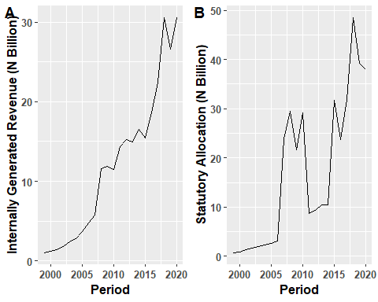
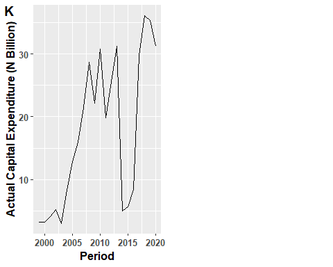
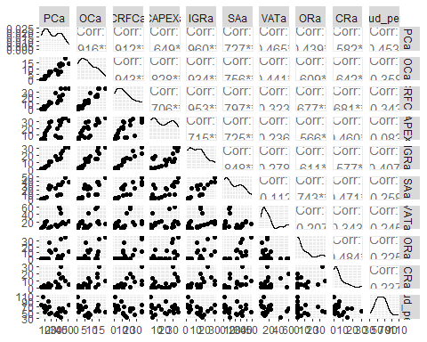

## Load the Required Packages


```r
install.packages("pastecs")  
install.packages("fBasics")
install.packages("timeDate")
install.packages("timeSeries")
install.packages("stats")
install.packages("vars")
install.packages("ggfortify")
tinytex::install_tinytex()
install.packages("tibble")
```
## Load library


```r
library(pastecs)
library(timeDate)
library(timeSeries)
library(fBasics)
library(dplyr)
```

```
## 
## Attaching package: 'dplyr'
```

```
## The following objects are masked from 'package:timeSeries':
## 
##     filter, lag
```

```
## The following objects are masked from 'package:pastecs':
## 
##     first, last
```

```
## The following objects are masked from 'package:stats':
## 
##     filter, lag
```

```
## The following objects are masked from 'package:base':
## 
##     intersect, setdiff, setequal, union
```

```r
library(ggplot2)
library(tidyr)
```

```
## 
## Attaching package: 'tidyr'
```

```
## The following object is masked from 'package:pastecs':
## 
##     extract
```

```r
library(vars)
```

```
## Loading required package: MASS
```

```
## 
## Attaching package: 'MASS'
```

```
## The following object is masked from 'package:dplyr':
## 
##     select
```

```
## Loading required package: strucchange
```

```
## Loading required package: zoo
```

```
## 
## Attaching package: 'zoo'
```

```
## The following object is masked from 'package:timeSeries':
## 
##     time<-
```

```
## The following objects are masked from 'package:base':
## 
##     as.Date, as.Date.numeric
```

```
## Loading required package: sandwich
```

```
## Loading required package: urca
```

```
## Loading required package: lmtest
```

```r
library(ggfortify)
library(GGally)
```

```
## Registered S3 method overwritten by 'GGally':
##   method from   
##   +.gg   ggplot2
```

```r
library(ggpubr)
library(tinytex)
library(tibble)
```
## Read the data


```r
bud <- read.csv("~/PhD_Thesis/Data/budget_information.csv", header = TRUE)
bud <- as_tibble(bud)
```

## Inspect the data


```r
names(bud) # To know the variable names
```

```
##  [1] "period" "PCe"    "PCa"    "OCe"    "OCa"    "CRFCe"  "CRFCa"  "SFe"   
##  [9] "SFa"    "CAPEXe" "CAPEXa" "IGRe"   "IGRa"   "SAe"    "SAa"    "VATe"  
## [17] "VATa"   "ORe"    "ORa"    "CRe"    "CRa"    "TRRe"   "TRRa"   "TRe"   
## [25] "TRa"    "TREe"   "TREa"   "TEe"    "TEa"
```

```r
str(bud)  # To know the class of the variables
```

```
## tibble [22 x 29] (S3: tbl_df/tbl/data.frame)
##  $ period: int [1:22] 1999 2000 2001 2002 2003 2004 2005 2006 2007 2008 ...
##  $ PCe   : num [1:22] 2.00e+09 4.05e+09 9.11e+09 1.01e+10 1.14e+10 ...
##  $ PCa   : num [1:22] 3.07e+09 5.90e+09 7.49e+09 7.65e+09 9.39e+09 ...
##  $ OCe   : num [1:22] 4.35e+08 7.15e+08 1.11e+09 1.71e+09 2.10e+09 ...
##  $ OCa   : num [1:22] 4.36e+08 6.39e+08 1.02e+09 8.59e+08 1.24e+09 ...
##  $ CRFCe : num [1:22] 1.15e+09 7.47e+08 1.84e+09 1.77e+09 2.50e+09 ...
##  $ CRFCa : num [1:22] 2.03e+08 1.01e+09 1.75e+09 4.55e+09 1.43e+09 ...
##  $ SFe   : num [1:22] 1.2e+07 0.0 0.0 0.0 0.0 0.0 0.0 0.0 0.0 0.0 ...
##  $ SFa   : num [1:22] 0 0 0 0 0 0 0 0 0 0 ...
##  $ CAPEXe: num [1:22] 5.33e+09 4.55e+09 8.27e+09 1.30e+10 1.26e+10 ...
##  $ CAPEXa: num [1:22] 3.25e+09 3.18e+09 4.15e+09 5.17e+09 3.04e+09 ...
##  $ IGRe  : num [1:22] 1.96e+09 1.79e+09 4.41e+09 5.55e+09 3.50e+09 ...
##  $ IGRa  : num [1:22] 1.06e+09 1.19e+09 1.44e+09 1.78e+09 2.41e+09 ...
##  $ SAe   : num [1:22] 5.29e+08 7.00e+08 1.00e+09 1.50e+09 2.00e+09 ...
##  $ SAa   : num [1:22] 7.58e+08 8.82e+08 1.37e+09 1.69e+09 1.98e+09 ...
##  $ VATe  : num [1:22] 2.06e+09 5.90e+09 1.19e+10 1.55e+10 1.60e+10 ...
##  $ VATa  : num [1:22] 3.17e+09 9.18e+09 8.48e+09 9.92e+09 1.29e+10 ...
##  $ ORe   : num [1:22] 0 0 0 0 0 ...
##  $ ORa   : num [1:22] 0 0 0 0 0 ...
##  $ CRe   : num [1:22] 4.38e+09 1.67e+09 3.00e+09 4.00e+09 7.08e+09 ...
##  $ CRa   : num [1:22] 1.81e+09 3.69e+07 3.57e+07 3.21e+09 9.83e+06 ...
##  $ TRRe  : num [1:22] 4.54e+09 8.39e+09 1.73e+10 2.26e+10 2.15e+10 ...
##  $ TRRa  : num [1:22] 4.99e+09 1.13e+10 1.13e+10 1.34e+10 1.73e+10 ...
##  $ TRe   : num [1:22] 8.92e+09 1.01e+10 2.03e+10 2.66e+10 2.86e+10 ...
##  $ TRa   : num [1:22] 6.80e+09 1.13e+10 1.13e+10 1.66e+10 1.73e+10 ...
##  $ TREe  : num [1:22] 3.60e+09 5.51e+09 1.21e+10 1.36e+10 1.60e+10 ...
##  $ TREa  : num [1:22] 3.71e+09 7.55e+09 1.03e+10 1.31e+10 1.21e+10 ...
##  $ TEe   : num [1:22] 8.92e+09 1.01e+10 2.03e+10 2.66e+10 2.86e+10 ...
##  $ TEa   : num [1:22] 6.96e+09 1.07e+10 1.44e+10 1.82e+10 1.51e+10 ...
```

## Computation of the annual budget performance

Annual Budget performance is Given as

$$bud\_perf=\frac{TEa}{TEe}*100\%$$

Where:
`bud_perf = Annual Budget Performance`
`TEa = Actual Total Expenditure`
`TEe = Estimated Total Expenditure`


```r
bud <- bud %>% 
  mutate(bud_perf=(TEa/TEe)*100)

names(bud)
```

```
##  [1] "period"   "PCe"      "PCa"      "OCe"      "OCa"      "CRFCe"   
##  [7] "CRFCa"    "SFe"      "SFa"      "CAPEXe"   "CAPEXa"   "IGRe"    
## [13] "IGRa"     "SAe"      "SAa"      "VATe"     "VATa"     "ORe"     
## [19] "ORa"      "CRe"      "CRa"      "TRRe"     "TRRa"     "TRe"     
## [25] "TRa"      "TREe"     "TREa"     "TEe"      "TEa"      "bud_perf"
```


## Transform the dataset into timeseries


```r
bud <- bud %>% 
  dplyr::select(-period) %>% 
  ts(start = 1999, end = 2020, frequency = 1)
```


## Summary Statistics

```r
pastecs::stat.desc(bud)
```

```
##                       PCe          PCa          OCe          OCa        CRFCe
## nbr.val      2.200000e+01 2.200000e+01 2.200000e+01 2.200000e+01 2.200000e+01
## nbr.null     0.000000e+00 0.000000e+00 0.000000e+00 0.000000e+00 0.000000e+00
## nbr.na       0.000000e+00 0.000000e+00 0.000000e+00 0.000000e+00 0.000000e+00
## min          1.995955e+09 3.067967e+09 4.353460e+08 4.356722e+08 7.471015e+08
## max          5.607377e+10 5.148414e+10 2.539972e+10 1.902633e+10 5.328749e+10
## range        5.407782e+10 4.841617e+10 2.496438e+10 1.859066e+10 5.254039e+10
## sum          6.080931e+11 5.152027e+11 2.391109e+11 1.555501e+11 4.141703e+11
## median       2.425031e+10 1.913066e+10 1.182963e+10 6.536960e+09 1.637587e+10
## mean         2.764060e+10 2.341830e+10 1.086868e+10 7.070458e+09 1.882592e+10
## SE.mean      3.832713e+09 3.166897e+09 1.777243e+09 1.164820e+09 3.439842e+09
## CI.mean.0.95 7.970563e+09 6.585922e+09 3.695979e+09 2.422376e+09 7.153544e+09
## var          3.231731e+20 2.206432e+20 6.948902e+19 2.984974e+19 2.603154e+20
## std.dev      1.797702e+10 1.485406e+10 8.336008e+09 5.463491e+09 1.613429e+10
## coef.var     6.503846e-01 6.342929e-01 7.669754e-01 7.727210e-01 8.570254e-01
##                     CRFCa          SFe SFa       CAPEXe       CAPEXa
## nbr.val      2.200000e+01 2.200000e+01  22 2.200000e+01 2.200000e+01
## nbr.null     0.000000e+00 2.100000e+01  22 0.000000e+00 0.000000e+00
## nbr.na       0.000000e+00 0.000000e+00   0 0.000000e+00 0.000000e+00
## min          2.034293e+08 0.000000e+00   0 4.546056e+09 3.043301e+09
## max          3.644220e+10 1.200000e+07   0 1.499420e+11 3.613193e+10
## range        3.623877e+10 1.200000e+07   0 1.453959e+11 3.308863e+10
## sum          3.119938e+11 1.200000e+07   0 1.221274e+12 3.871056e+11
## median       1.181449e+10 0.000000e+00   0 6.011838e+10 1.788523e+10
## mean         1.418154e+10 5.454545e+05   0 5.551243e+10 1.759571e+10
## SE.mean      2.552612e+09 5.454545e+05   0 8.415488e+09 2.564071e+09
## CI.mean.0.95 5.308446e+09 1.134335e+06   0 1.750097e+10 5.332278e+09
## var          1.433482e+20 6.545455e+12   0 1.558050e+21 1.446381e+20
## std.dev      1.197281e+10 2.558409e+06   0 3.947214e+10 1.202656e+10
## coef.var     8.442533e-01 4.690416e+00 NaN 7.110504e-01 6.834938e-01
##                      IGRe         IGRa          SAe          SAa         VATe
## nbr.val      2.200000e+01 2.200000e+01 2.200000e+01 2.200000e+01 2.200000e+01
## nbr.null     0.000000e+00 0.000000e+00 0.000000e+00 0.000000e+00 0.000000e+00
## nbr.na       0.000000e+00 0.000000e+00 0.000000e+00 0.000000e+00 0.000000e+00
## min          1.790893e+09 1.060040e+09 5.292727e+08 7.580331e+08 2.057721e+09
## max          1.254768e+11 3.058315e+10 5.500000e+10 4.855481e+10 5.040000e+10
## range        1.236859e+11 2.952311e+10 5.447073e+10 4.779678e+10 4.834228e+10
## sum          7.151716e+11 2.651138e+11 5.644044e+11 3.705486e+11 3.135282e+11
## median       2.921859e+10 1.171777e+10 2.981554e+10 1.039273e+10 1.101538e+10
## mean         3.250780e+10 1.205063e+10 2.565475e+10 1.684312e+10 1.425128e+10
## SE.mean      7.089304e+09 2.028867e+09 3.738544e+09 3.235597e+09 2.838402e+09
## CI.mean.0.95 1.474301e+10 4.219260e+09 7.774728e+09 6.728792e+09 5.902779e+09
## var          1.105681e+21 9.055863e+19 3.074877e+20 2.303199e+20 1.772435e+20
## std.dev      3.325178e+10 9.516230e+09 1.753533e+10 1.517629e+10 1.331328e+10
## coef.var     1.022886e+00 7.896876e-01 6.835120e-01 9.010384e-01 9.341814e-01
##                      VATa          ORe          ORa          CRe          CRa
## nbr.val      2.200000e+01 2.200000e+01 2.200000e+01 2.200000e+01 2.200000e+01
## nbr.null     0.000000e+00 5.000000e+00 1.300000e+01 0.000000e+00 0.000000e+00
## nbr.na       0.000000e+00 0.000000e+00 0.000000e+00 0.000000e+00 0.000000e+00
## min          3.172675e+09 0.000000e+00 0.000000e+00 1.668723e+09 9.825133e+06
## max          5.907908e+10 4.021280e+10 3.692084e+10 7.850000e+10 2.974011e+10
## range        5.590641e+10 4.021280e+10 3.692084e+10 7.683128e+10 2.973029e+10
## sum          3.931256e+11 2.251282e+11 1.573972e+11 6.169314e+11 1.335369e+11
## median       1.254095e+10 4.871593e+09 0.000000e+00 2.774831e+10 3.496137e+09
## mean         1.786935e+10 1.023310e+10 7.154419e+09 2.804234e+10 6.069860e+09
## SE.mean      3.317743e+09 2.476304e+09 2.455728e+09 5.003122e+09 1.618311e+09
## CI.mean.0.95 6.899625e+09 5.149756e+09 5.106967e+09 1.040456e+10 3.365462e+09
## var          2.421632e+20 1.349058e+20 1.326732e+20 5.506871e+20 5.761648e+19
## std.dev      1.556160e+10 1.161490e+10 1.151839e+10 2.346672e+10 7.590552e+09
## coef.var     8.708543e-01 1.135032e+00 1.609968e+00 8.368320e-01 1.250532e+00
##                      TRRe         TRRa          TRe          TRa         TREe
## nbr.val      2.200000e+01 2.200000e+01 2.200000e+01 2.200000e+01 2.200000e+01
## nbr.null     0.000000e+00 0.000000e+00 0.000000e+00 0.000000e+00 0.000000e+00
## nbr.na       0.000000e+00 0.000000e+00 0.000000e+00 0.000000e+00 0.000000e+00
## min          4.544790e+09 4.990748e+09 8.923847e+09 6.797918e+09 3.597494e+09
## max          2.266896e+11 1.318472e+11 2.717317e+11 1.424030e+11 1.275747e+11
## range        2.221448e+11 1.268564e+11 2.628079e+11 1.356051e+11 1.239772e+11
## sum          1.790592e+12 1.186185e+12 2.407523e+12 1.319722e+12 1.261386e+12
## median       7.674014e+10 5.606187e+10 1.136801e+11 5.824857e+10 5.266902e+10
## mean         8.139054e+10 5.391751e+10 1.094329e+11 5.998737e+10 5.733574e+10
## SE.mean      1.244989e+10 7.656967e+09 1.631274e+10 8.803720e+09 8.753286e+09
## CI.mean.0.95 2.589095e+10 1.592353e+10 3.392420e+10 1.830834e+10 1.820345e+10
## var          3.409992e+21 1.289841e+21 5.854320e+21 1.705121e+21 1.685640e+21
## std.dev      5.839514e+10 3.591436e+10 7.651353e+10 4.129311e+10 4.105655e+10
## coef.var     7.174684e-01 6.660983e-01 6.991823e-01 6.883634e-01 7.160726e-01
##                      TREa          TEe          TEa     bud_perf
## nbr.val      2.200000e+01 2.200000e+01 2.200000e+01   22.0000000
## nbr.null     0.000000e+00 0.000000e+00 0.000000e+00    0.0000000
## nbr.na       0.000000e+00 0.000000e+00 0.000000e+00    0.0000000
## min          3.707068e+09 8.923847e+09 6.956472e+09   32.0997054
## max          1.018134e+11 2.717317e+11 1.379453e+11  106.6111519
## range        9.810628e+10 2.628079e+11 1.309888e+11   74.5114465
## sum          9.827465e+11 2.482660e+12 1.369852e+12 1365.2154511
## median       3.831700e+10 1.336301e+11 6.198883e+10   61.9580887
## mean         4.467030e+10 1.128482e+11 6.226601e+10   62.0552478
## SE.mean      6.709072e+09 1.656382e+10 8.735885e+09    3.6591990
## CI.mean.0.95 1.395228e+10 3.444636e+10 1.816727e+10    7.6097209
## var          9.902564e+20 6.035926e+21 1.678945e+21  294.5742182
## std.dev      3.146834e+10 7.769122e+10 4.097493e+10   17.1631646
## coef.var     7.044578e-01 6.884580e-01 6.580626e-01    0.2765788
```


```r
fBasics::basicStats(bud)
```

```
##                       PCe           PCa           OCe           OCa
## nobs         2.200000e+01  2.200000e+01  2.200000e+01  2.200000e+01
## NAs          0.000000e+00  0.000000e+00  0.000000e+00  0.000000e+00
## Minimum      1.995955e+09  3.067967e+09  4.353460e+08  4.356722e+08
## Maximum      5.607377e+10  5.148414e+10  2.539972e+10  1.902633e+10
## 1. Quartile  1.134098e+10  9.478036e+09  2.643657e+09  2.615196e+09
## 3. Quartile  4.299762e+10  3.566710e+10  1.811273e+10  1.148824e+10
## Mean         2.764060e+10  2.341830e+10  1.086868e+10  7.070458e+09
## Median       2.425031e+10  1.913066e+10  1.182963e+10  6.536960e+09
## Sum          6.080931e+11  5.152027e+11  2.391109e+11  1.555501e+11
## SE Mean      3.832713e+09  3.166897e+09  1.777243e+09  1.164820e+09
## LCL Mean     1.967003e+10  1.683238e+10  7.172698e+09  4.648082e+09
## UCL Mean     3.561116e+10  3.000422e+10  1.456466e+10  9.492834e+09
## Variance     3.231731e+20  2.206432e+20  6.948902e+19  2.984974e+19
## Stdev        1.797702e+10  1.485406e+10  8.336008e+09  5.463491e+09
## Skewness     1.468180e-01  2.645450e-01  1.599770e-01  5.021680e-01
## Kurtosis    -1.638912e+00 -1.428906e+00 -1.569667e+00 -9.814010e-01
##                     CRFCe         CRFCa           SFe SFa        CAPEXe
## nobs         2.200000e+01  2.200000e+01  2.200000e+01  22  2.200000e+01
## NAs          0.000000e+00  0.000000e+00  0.000000e+00   0  0.000000e+00
## Minimum      7.471015e+08  2.034293e+08  0.000000e+00   0  4.546056e+09
## Maximum      5.328749e+10  3.644220e+10  1.200000e+07   0  1.499420e+11
## 1. Quartile  5.435720e+09  4.553518e+09  0.000000e+00   0  1.650293e+10
## 3. Quartile  2.643750e+10  2.140213e+10  0.000000e+00   0  8.043055e+10
## Mean         1.882592e+10  1.418154e+10  5.454545e+05   0  5.551243e+10
## Median       1.637587e+10  1.181449e+10  0.000000e+00   0  6.011838e+10
## Sum          4.141703e+11  3.119938e+11  1.200000e+07   0  1.221274e+12
## SE Mean      3.439842e+09  2.552612e+09  5.454545e+05   0  8.415488e+09
## LCL Mean     1.167238e+10  8.873091e+09 -5.888803e+05   0  3.801147e+10
## UCL Mean     2.597946e+10  1.948998e+10  1.679789e+06   0  7.301340e+10
## Variance     2.603154e+20  1.433482e+20  6.545455e+12   0  1.558050e+21
## Stdev        1.613429e+10  1.197281e+10  2.558409e+06   0  3.947214e+10
## Skewness     6.880860e-01  6.149930e-01  4.070195e+00 NaN  3.729960e-01
## Kurtosis    -6.998700e-01 -9.443970e-01  1.526653e+01 NaN -6.893680e-01
##                    CAPEXa         IGRe          IGRa           SAe
## nobs         2.200000e+01 2.200000e+01  2.200000e+01  2.200000e+01
## NAs          0.000000e+00 0.000000e+00  0.000000e+00  0.000000e+00
## Minimum      3.043301e+09 1.790893e+09  1.060040e+09  5.292727e+08
## Maximum      3.613193e+10 1.254768e+11  3.058315e+10  5.500000e+10
## 1. Quartile  5.284413e+09 7.364712e+09  3.050654e+09  1.137500e+10
## 3. Quartile  2.946524e+10 3.685005e+10  1.627155e+10  3.918900e+10
## Mean         1.759571e+10 3.250780e+10  1.205063e+10  2.565475e+10
## Median       1.788523e+10 2.921859e+10  1.171777e+10  2.981554e+10
## Sum          3.871056e+11 7.151716e+11  2.651138e+11  5.644044e+11
## SE Mean      2.564071e+09 7.089304e+09  2.028867e+09  3.738544e+09
## LCL Mean     1.226343e+10 1.776479e+10  7.831365e+09  1.788002e+10
## UCL Mean     2.292799e+10 4.725081e+10  1.626988e+10  3.342947e+10
## Variance     1.446381e+20 1.105681e+21  9.055863e+19  3.074877e+20
## Stdev        1.202656e+10 3.325178e+10  9.516230e+09  1.753533e+10
## Skewness     1.133220e-01 1.390183e+00  5.040740e-01 -1.413070e-01
## Kurtosis    -1.684043e+00 1.244670e+00 -9.432840e-01 -1.374042e+00
##                       SAa         VATe         VATa          ORe          ORa
## nobs         2.200000e+01 2.200000e+01 2.200000e+01 2.200000e+01 2.200000e+01
## NAs          0.000000e+00 0.000000e+00 0.000000e+00 0.000000e+00 0.000000e+00
## Minimum      7.580331e+08 2.057721e+09 3.172675e+09 0.000000e+00 0.000000e+00
## Maximum      4.855481e+10 5.040000e+10 5.907908e+10 4.021280e+10 3.692084e+10
## 1. Quartile  2.430940e+09 4.625000e+09 8.521639e+09 2.187500e+09 0.000000e+00
## 3. Quartile  2.936026e+10 1.587500e+10 1.950781e+10 1.575000e+10 1.104438e+10
## Mean         1.684312e+10 1.425128e+10 1.786935e+10 1.023310e+10 7.154419e+09
## Median       1.039273e+10 1.101538e+10 1.254095e+10 4.871593e+09 0.000000e+00
## Sum          3.705486e+11 3.135282e+11 3.931256e+11 2.251282e+11 1.573972e+11
## SE Mean      3.235597e+09 2.838402e+09 3.317743e+09 2.476304e+09 2.455728e+09
## LCL Mean     1.011432e+10 8.348504e+09 1.096972e+10 5.083342e+09 2.047453e+09
## UCL Mean     2.357191e+10 2.015406e+10 2.476897e+10 1.538285e+10 1.226139e+10
## Variance     2.303199e+20 1.772435e+20 2.421632e+20 1.349058e+20 1.326732e+20
## Stdev        1.517629e+10 1.331328e+10 1.556160e+10 1.161490e+10 1.151839e+10
## Skewness     4.575860e-01 1.705042e+00 1.557811e+00 1.099644e+00 1.446848e+00
## Kurtosis    -1.254280e+00 2.117332e+00 1.337699e+00 7.354200e-02 7.717860e-01
##                       CRe          CRa          TRRe          TRRa
## nobs         2.200000e+01 2.200000e+01  2.200000e+01  2.200000e+01
## NAs          0.000000e+00 0.000000e+00  0.000000e+00  0.000000e+00
## Minimum      1.668723e+09 9.825133e+06  4.544790e+09  4.990748e+09
## Maximum      7.850000e+10 2.974011e+10  2.266896e+11  1.318472e+11
## 1. Quartile  5.683313e+09 6.988559e+08  3.140664e+10  2.413090e+10
## 3. Quartile  4.563896e+10 8.097979e+09  1.107055e+11  7.898707e+10
## Mean         2.804234e+10 6.069860e+09  8.139054e+10  5.391751e+10
## Median       2.774831e+10 3.496137e+09  7.674014e+10  5.606187e+10
## Sum          6.169314e+11 1.335369e+11  1.790592e+12  1.186185e+12
## SE Mean      5.003122e+09 1.618311e+09  1.244989e+10  7.656967e+09
## LCL Mean     1.763777e+10 2.704398e+09  5.549958e+10  3.799397e+10
## UCL Mean     3.844690e+10 9.435322e+09  1.072815e+11  6.984104e+10
## Variance     5.506871e+20 5.761648e+19  3.409992e+21  1.289841e+21
## Stdev        2.346672e+10 7.590552e+09  5.839514e+10  3.591436e+10
## Skewness     4.833140e-01 1.595515e+00  6.417210e-01  3.505030e-01
## Kurtosis    -1.021868e+00 2.004840e+00 -2.625360e-01 -1.053963e+00
##                       TRe           TRa          TREe          TREa
## nobs         2.200000e+01  2.200000e+01  2.200000e+01  2.200000e+01
## NAs          0.000000e+00  0.000000e+00  0.000000e+00  0.000000e+00
## Minimum      8.923847e+09  6.797918e+09  3.597494e+09  3.707068e+09
## Maximum      2.717317e+11  1.424030e+11  1.275747e+11  1.018134e+11
## 1. Quartile  3.586869e+10  2.496480e+10  1.936576e+10  1.506436e+10
## 3. Quartile  1.693068e+11  8.384217e+10  9.548369e+10  6.842455e+10
## Mean         1.094329e+11  5.998737e+10  5.733574e+10  4.467030e+10
## Median       1.136801e+11  5.824857e+10  5.266902e+10  3.831700e+10
## Sum          2.407523e+12  1.319722e+12  1.261386e+12  9.827465e+11
## SE Mean      1.631274e+10  8.803720e+09  8.753286e+09  6.709072e+09
## LCL Mean     7.550868e+10  4.167903e+10  3.913228e+10  3.071802e+10
## UCL Mean     1.433571e+11  7.829570e+10  7.553919e+10  5.862258e+10
## Variance     5.854320e+21  1.705121e+21  1.685640e+21  9.902564e+20
## Stdev        7.651353e+10  4.129311e+10  4.105655e+10  3.146834e+10
## Skewness     2.557980e-01  3.903830e-01  2.095040e-01  3.695490e-01
## Kurtosis    -1.170685e+00 -1.138558e+00 -1.535804e+00 -1.250881e+00
##                       TEe           TEa    bud_perf
## nobs         2.200000e+01  2.200000e+01   22.000000
## NAs          0.000000e+00  0.000000e+00    0.000000
## Minimum      8.923847e+09  6.956472e+09   32.099705
## Maximum      2.717317e+11  1.379453e+11  106.611152
## 1. Quartile  3.586869e+10  2.447802e+10   50.576244
## 3. Quartile  1.732055e+11  8.975216e+10   70.568327
## Mean         1.128482e+11  6.226601e+10   62.055248
## Median       1.336301e+11  6.198883e+10   61.958089
## Sum          2.482660e+12  1.369852e+12 1365.215451
## SE Mean      1.656382e+10  8.735885e+09    3.659199
## LCL Mean     7.840181e+10  4.409874e+10   54.445527
## UCL Mean     1.472945e+11  8.043328e+10   69.664969
## Variance     6.035926e+21  1.678945e+21  294.574218
## Stdev        7.769122e+10  4.097493e+10   17.163165
## Skewness     1.446790e-01  3.257690e-01    0.608395
## Kurtosis    -1.293833e+00 -1.165923e+00    0.171133
```

## PLots
# Revenue variables with budget performance

We overlayed budget performace with other revenue variables to identify any visual relationship
Where:-
`IGRa` - Actual Internally Generated Revenue
`SAa`  - Actual Statutory Allocation
`VATa` - Actual VAT
`ORa`  - Actual Other Revenue
`CRA`  - Actual Capital Receipts

```r
bud_rev <- bud[,c(12,14,16,18,20,29)]
bud_rev %>% 
ggplot2::autoplot()
```

<!-- -->


# Expenditure variables with budget performance

We overlayed budget performace with other expenditure variables to identify any visual relationship
Where:-
`PCa`    - Actual Personnel Cost
`OCa`    - Actual Overhead Cost
`CRFCa`  - Actual Consolidated Revenue Fund Charges
`SFa`    - Actual Stablisation Fund
`CAPEXa` - Actual Capital Expenditure

```r
bud_exp <- bud[,c(2,4,6,8,10,29)]
bud_exp %>% 
ggplot2::autoplot()
```

<!-- -->


## Individual Graphs
# Revenue

```r
g_IGRa <- bud_rev[,1] %>% 
       ggplot2::autoplot() +
         theme(text = element_text(size = 12, face = "bold"))+
         xlab("Period") + 
         ylab("Internally Generated Revenue")

g_SAa <- bud_rev[,2] %>% 
       ggplot2::autoplot() +
         theme(text = element_text(size = 12, face = "bold"))+
         xlab("Period") + 
         ylab("Statutory Allocation")

g_VATa <-  bud_rev[,3] %>% 
       ggplot2::autoplot() +
         theme(text = element_text(size = 12, face = "bold"))+
         xlab("Period") + 
         ylab("VAT")


g_ORa <- bud_rev[,4] %>% 
       ggplot2::autoplot() +
         theme(text = element_text(size = 12, face = "bold"))+
         xlab("Period") + 
         ylab("Other Revenue")

g_CRa <- bud_rev[,5] %>% 
       ggplot2::autoplot() +
         theme(text = element_text(size = 12, face = "bold"))+
         xlab("Period") + 
         ylab("Actual Capital Receipts")

g_bud_perf <- bud_rev[,6] %>% 
       ggplot2::autoplot() +
         theme(text = element_text(size = 12, face = "bold"))+
         xlab("Period") + 
         ylab("Budget Performance")

ggarrange(g_IGRa, g_SAa, 
          labels = c("A", "B"),
          ncol = 2, nrow = 1)
```

<!-- -->

```r
ggarrange(g_VATa, g_ORa, 
          labels = c("C", "D"),
          ncol = 2, nrow = 1)
```

<!-- -->

```r
ggarrange(g_CRa, g_bud_perf, 
          labels = c("E", "F"),
          ncol = 2, nrow = 1)
```

<!-- -->

# Expenditure


```r
g_PCa <- bud_exp[,1] %>% 
       ggplot2::autoplot() +
         theme(text = element_text(size = 12, face = "bold"))+
         xlab("Period") + 
         ylab("Actual Capital Expenditure")

g_OCa <- bud_exp[,2] %>% 
       ggplot2::autoplot() +
         theme(text = element_text(size = 12, face = "bold"))+
         xlab("Period") + 
         ylab("Actual Overhead Cost")

g_CRFCa <-  bud_exp[,3] %>% 
       ggplot2::autoplot() +
         theme(text = element_text(size = 12, face = "bold"))+
         xlab("Period") + 
         ylab("Actual Consolidated Renue Fund Charges")


g_SFa <- bud_exp[,4] %>% 
       ggplot2::autoplot() +
         theme(text = element_text(size = 12, face = "bold"))+
         xlab("Period") + 
         ylab("Actual Stablisation Fund")

g_CAPEXa <- bud_exp[,5] %>% 
       ggplot2::autoplot() +
         theme(text = element_text(size = 12, face = "bold"))+
         xlab("Period") + 
         ylab("Actual Capital Expenditure")


ggarrange(g_PCa, g_OCa, 
          labels = c("G", "H"),
          ncol = 2, nrow = 1)
```

<!-- -->

```r
ggarrange(g_CRFCa, g_SFa, 
          labels = c("I", "J"),
          ncol = 2, nrow = 1)
```

<!-- -->

```r
ggarrange(g_CAPEXa, 
          labels = c("K"),
          ncol = 2, nrow = 1)
```

<!-- -->


## Correlation Matrix


```r
bud_corr <-  bud[,c(2,4,6,8,10,12,14,16,18,20,29)]
bud_corr %>% 
  as.data.frame() %>% 
  ggpairs()
```

```
## Warning in cor(x, y): the standard deviation is zero

## Warning in cor(x, y): the standard deviation is zero

## Warning in cor(x, y): the standard deviation is zero

## Warning in cor(x, y): the standard deviation is zero

## Warning in cor(x, y): the standard deviation is zero

## Warning in cor(x, y): the standard deviation is zero

## Warning in cor(x, y): the standard deviation is zero

## Warning in cor(x, y): the standard deviation is zero

## Warning in cor(x, y): the standard deviation is zero

## Warning in cor(x, y): the standard deviation is zero
```

<!-- -->
